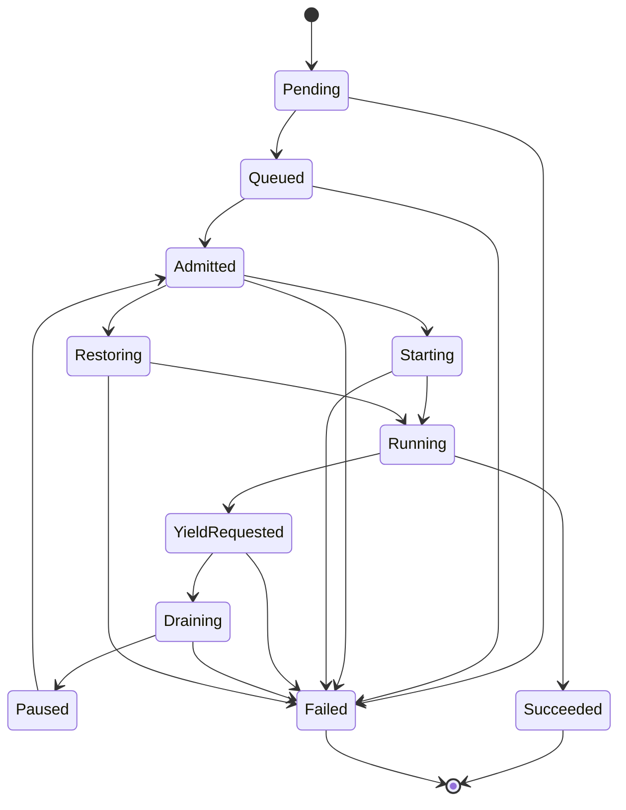
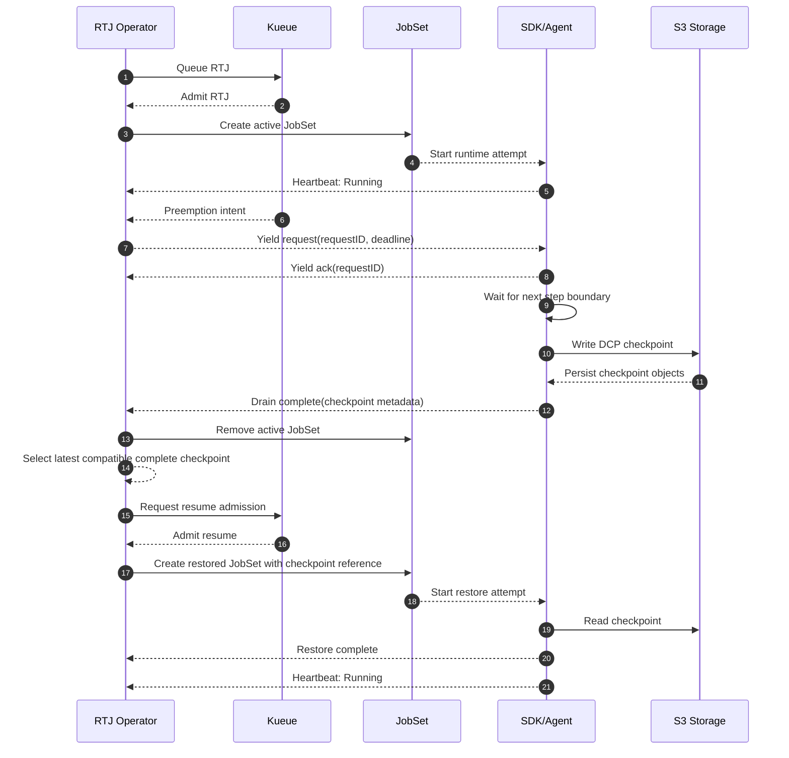

# Lifecycle State Machine

This document defines the conceptual Phase 0 lifecycle state machine for `ResumableTrainingJob` (`RTJ`).
It is the authoritative Phase 0 description of the controller-visible phase enum and the allowed transitions between phases.

## Purpose

The lifecycle model MUST make three things explicit for `v1`:

- what high-level phase an RTJ is in
- which transitions are allowed
- what conditions and side effects accompany those transitions

The state machine is intentionally narrow and aligned to the accepted `v1` scope:
one cluster, Kueue authority, JobSet-only runtime, PyTorch DCP checkpoints to S3-compatible storage, and fail-closed same-identity resume.

## Phases Versus Conditions

`status.phase` and `status.conditions` serve different purposes and MUST NOT be conflated.

- A phase is the single controller-derived summary of the RTJ's dominant lifecycle state.
- A condition is a controller-authored fact about one aspect of the RTJ, such as admission, checkpoint readiness, or degradation.

An RTJ MUST have exactly one phase at a time.
An RTJ MAY have many conditions at a time.

Example:

- `phase: Draining`
- `Admitted=True`
- `YieldRequested=True`
- `CheckpointReady=False`

That is valid because the phase answers "where is the RTJ in the lifecycle?" while the conditions answer "what specific facts are currently true?".

## Phase Enum

The conceptual `v1` phase enum is:

| Phase | Meaning |
| --- | --- |
| `Pending` | The RTJ exists but is not yet ready to enter queueing or runtime reconciliation. |
| `Queued` | The RTJ has a valid desired spec and is waiting for Kueue admission. |
| `Admitted` | Kueue has granted admission, but the runtime attempt has not started yet. |
| `Starting` | The operator is creating or converging the active JobSet and the runtime is not yet confirmed as running. |
| `Running` | The RTJ has valid admission and one active JobSet-backed runtime attempt that is executing training work. |
| `YieldRequested` | A manual or Kueue-driven yield intent has been accepted, but the runtime has not yet acknowledged the current yield request. |
| `Draining` | The runtime has acknowledged the yield request and is waiting for a step boundary or writing the required checkpoint. |
| `Paused` | The RTJ has no active training Pods and has converged to a yielded state after a completed checkpoint. |
| `Restoring` | The operator has selected the latest compatible complete checkpoint and is converging a new runtime attempt to restore from it. |
| `Succeeded` | The workload has completed successfully. |
| `Failed` | The RTJ cannot continue safely because validation, admission, drain, compatibility, or restore rules failed. |

## Allowed Transitions

Only the transitions in this section are allowed in `v1`.
Any attempted transition outside this set MUST be rejected or ignored and MUST leave the RTJ in its current valid phase.

### High-Level State Machine

### Happy-Path Controlled Preemption Flow

## Transition Table

| From | To | Trigger | Guards | Side Effects | Failure Handling |
| --- | --- | --- | --- | --- | --- |
| `Pending` | `Queued` | RTJ spec is accepted for reconciliation | Required user-authored fields are present and valid | Record `Queued`; publish `Admitted=False` and `Running=False` conditions as appropriate | Validation failure transitions to `Failed` with a stable reason and message |
| `Queued` | `Admitted` | Kueue grants admission | Admission is valid for this RTJ generation | Record `admittedAt`; publish `Admitted=True` | Loss or absence of admission keeps the RTJ in `Queued` |
| `Admitted` | `Starting` | Operator decides to materialize the active runtime attempt | No other active JobSet exists for the RTJ; runtime template resolves to JobSet | Increment or initialize `currentRunAttempt`; create or converge the JobSet | Runtime-creation failure transitions to `Failed` if retry policy is exhausted; otherwise remain `Admitted` |
| `Starting` | `Running` | Runtime heartbeats or equivalent persisted evidence show training is live | Admission still valid; exactly one active JobSet exists | Record `runningAt`; publish `Running=True` | Startup timeout or irrecoverable runtime failure transitions to `Failed` |
| `Running` | `YieldRequested` | Manual yield intent is accepted or Kueue-driven yield intent is observed | RTJ is in scope for graceful yield; no newer yield request supersedes the current one | Persist a new yield request identifier and deadline; publish `YieldRequested=True` | If the RTJ already completed, ignore the trigger; if the request is invalid, remain `Running` and report why |
| `YieldRequested` | `Draining` | Runtime acknowledges the current yield request | Ack references the latest yield request identifier and active run attempt | Record `yieldRequestedAt` if not already set; begin drain tracking and checkpoint monitoring | Missing ack by `yieldAckTimeout` transitions to `Failed` |
| `Draining` | `Paused` | Runtime reports a completed checkpoint and the operator verifies required metadata | Checkpoint belongs to the same RTJ lineage; completeness and compatibility evidence meet the `v1` contract; active runtime is removed or converging to zero Pods | Record `lastCheckpointCompletedAt` and `pausedAt`; publish `CheckpointReady=True`; clear active runtime | Drain timeout, incomplete checkpoint, or incompatible metadata transitions to `Failed` |
| `Paused` | `Admitted` | Resume is desired and Kueue grants admission for a new attempt | `spec.control.desiredState` is `Running` or resume is otherwise desired; no active runtime exists | Publish `Admitted=True` for the resume path | Without admission the RTJ remains `Paused` |
| `Admitted` | `Restoring` | Operator selects the latest compatible complete checkpoint for the next runtime attempt | `lastCompletedCheckpoint` or another candidate exists and passes ADR 0003 compatibility checks | Set `selectedCheckpoint`; record `restoringAt`; create the restoring JobSet | No compatible complete checkpoint transitions to `Failed` |
| `Restoring` | `Running` | Runtime reports restore success and emits running heartbeat | Admission still valid; selected checkpoint still matches the intended attempt | Record restore completion time; publish `Running=True` | Restore timeout or restore failure transitions to `Failed`; controller MAY retry until `maxResumeRetries` is exhausted |
| `Running` | `Succeeded` | Runtime completion is reported | Workload exits successfully under the active attempt | Record `succeededAt`; clear active runtime ownership | Any post-completion mutation that would require a new attempt MUST create a new reconciliation path rather than reopening `Succeeded` |
| `Pending` | `Failed` | Validation or invariant violation is detected before queueing | Violation is not safely recoverable by retry | Publish `Degraded=True` and stable diagnostic fields | Terminal |
| `Queued` | `Failed` | Queueing prerequisites or invariants fail irrecoverably | The controller cannot safely wait or recover | Publish failure diagnostics | Terminal |
| `Admitted` | `Failed` | Admission becomes invalid in a way that prevents safe progress | No active runtime may be started or restored safely | Publish failure diagnostics and avoid starting a new JobSet | Terminal unless a future design adds explicit recovery semantics |
| `Starting` | `Failed` | Startup fails beyond allowed recovery policy | Retry budget is exhausted or invariants are broken | Preserve attempt diagnostics | Terminal |
| `YieldRequested` | `Failed` | Runtime does not acknowledge yield in time | `yieldAckTimeout` expires | Publish failure diagnostics and stop assuming graceful yield is in progress | Terminal |
| `Draining` | `Failed` | Safe point is not reached, checkpoint write fails, or completion evidence is unusable | `maxDrainTime` expires or checkpoint evidence is invalid | Preserve last known checkpoint references and failure reason | Terminal |
| `Restoring` | `Failed` | Restore cannot complete safely | `restoreTimeout` expires or resume retry budget is exhausted | Preserve selected checkpoint and restore diagnostics | Terminal |

## State Rules

- `Running` MUST imply valid admission and exactly one active JobSet-backed runtime attempt.
- `Paused` MUST imply no active training Pods for the RTJ.
- `YieldRequested` MUST imply a yield request identifier exists for the current runtime attempt.
- `Draining` MUST imply the current yield request was acknowledged by the runtime.
- `Restoring` MUST imply `status.selectedCheckpoint` is not `null`.
- `Succeeded` and `Failed` are terminal in this conceptual `v1` state machine.

## Notes On Failure Semantics

- `v1` prefers fail-closed behavior over hidden retries or ambiguous progress.
- Queue-driven yield and manual yield MUST converge on the same `YieldRequested -> Draining -> Paused` path once the operator accepts the intent.
- A later phase or condition MAY expose richer sub-status, but it MUST NOT weaken the single-phase model defined here.
