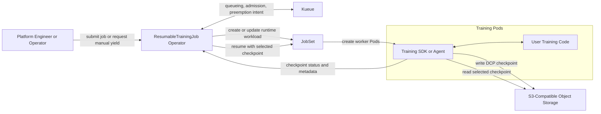
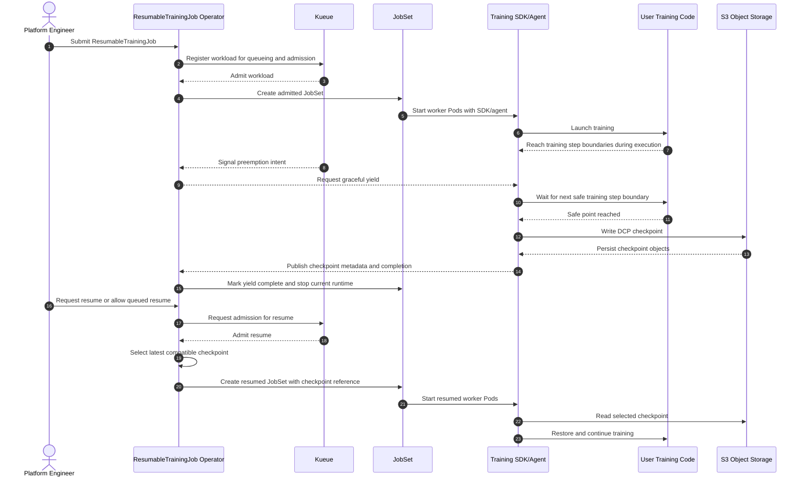

# System Context

This document describes the concrete `v1` system context for the `checkpoint-native preemption controller`.
It is intended to guide implementation planning by showing the main components, their interactions, and the source of authority for core decisions.

## Component Diagram

## Main Happy Path: Submission to Resume

## Authority Matrix

Legend:

- `A`: authoritative
- `S`: supporting but not authoritative
- `N`: not authoritative

| Concern | Kueue | ResumableTrainingJob Operator | JobSet | Training SDK/Agent | Object Storage | User Training Code | Notes |
| --- | --- | --- | --- | --- | --- | --- | --- |
| Admission | A | S | N | N | N | N | Kueue decides whether the workload may run. |
| Preemption intent | A | A | N | N | N | N | Kueue is authoritative for queue-driven intent; the operator is authoritative for manual yield intake and normalization. |
| Safe points | N | N | N | S | N | A | User code defines valid training step boundaries; the SDK/agent exposes them to the product flow. |
| Checkpoint writes | N | N | N | A | S | S | The SDK/agent performs DCP writes; object storage only persists bytes. |
| Checkpoint selection | N | A | N | N | N | N | The operator chooses the checkpoint used for resume under ADR 0003. |
| Restore orchestration | N | A | S | S | N | N | The operator initiates resume, JobSet carries the workload, and the SDK/agent performs in-process restore steps. |
| Runtime execution | N | N | S | S | N | A | User code owns training behavior; JobSet and the SDK/agent only host and mediate execution. |

## Implementation-Guiding Notes

- The operator MUST treat Kueue as the source of truth for admission and queue-driven preemption.
- The operator MUST NOT treat object presence in S3 as sufficient evidence of a compatible checkpoint without the metadata checks from ADR 0003.
- The SDK or agent MUST be the only component that writes DCP checkpoints.
- User training code MUST remain the source of truth for training-step semantics and safe-point placement.
- JobSet SHOULD remain a workload carrier and reconciler, not a place to embed product policy.
