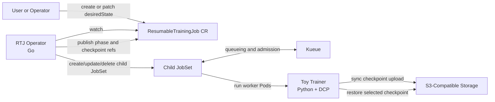
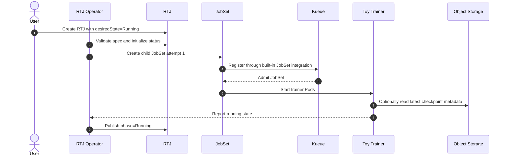
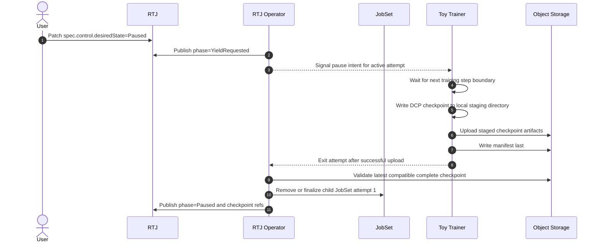
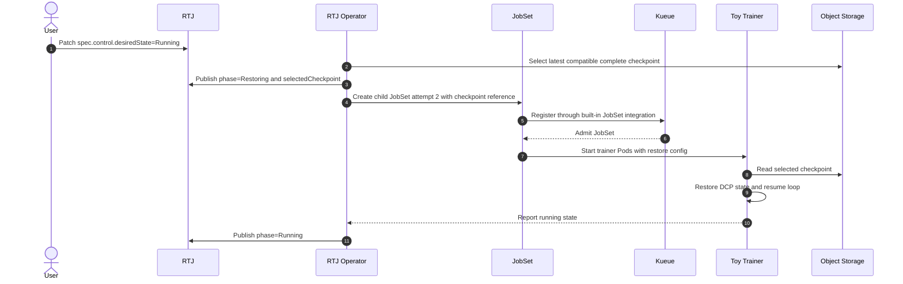

# Phase 1 Architecture

## Overview

Phase 1 keeps the Phase 0 authority model intact while narrowing implementation to one manual pause and resume path.
The operator owns RTJ lifecycle coordination.
Kueue owns queueing and admission for the child `JobSet`.
The Python trainer owns in-process checkpoint and restore work through PyTorch DCP.

Phase 1 intentionally does not implement Kueue-driven preemption yet.
Manual control uses `spec.control.desiredState`, which already exists in the accepted Phase 0 API contract, so no Phase 1 API extension is required for pause and resume.

Checkpointing is synchronous:

1. write checkpoint data to a local filesystem staging directory inside the Pod
2. upload staged artifacts to S3-compatible storage
3. publish the checkpoint manifest last
4. exit the running attempt only after upload and manifest publication succeed

## Component Diagram

## Launch Sequence

## Manual Pause Sequence

## Resume Sequence

## Design Notes

- The child runtime stays a `JobSet` so Kueue can manage it through built-in integration. Phase 1 does not add native Kueue custom-job support for RTJ itself.
- `spec.control.desiredState` is the only manual control surface for the slice. A later phase may add a subresource or other transport, but Phase 1 does not need a new API field.
- The default fixture should use CPU plus `gloo` so the entire path runs inside `kind` without GPU dependencies.
- Object storage should be local and disposable in development, but the checkpoint layout and manifest-last semantics must still match the accepted Phase 0 contracts.
- The operator must preserve the single-active-runtime invariant even during pause and resume transitions.
