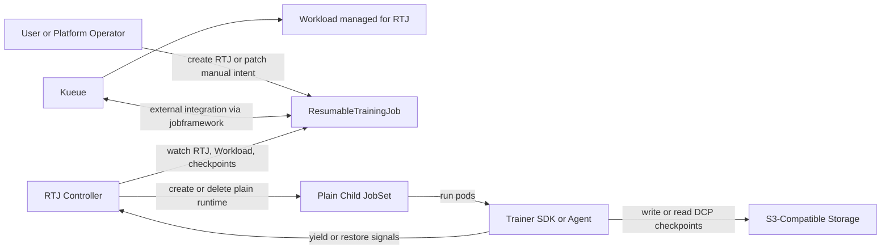
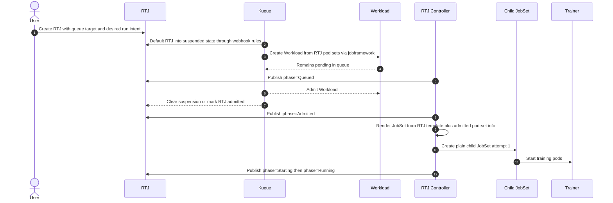
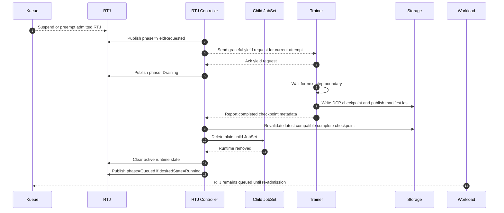
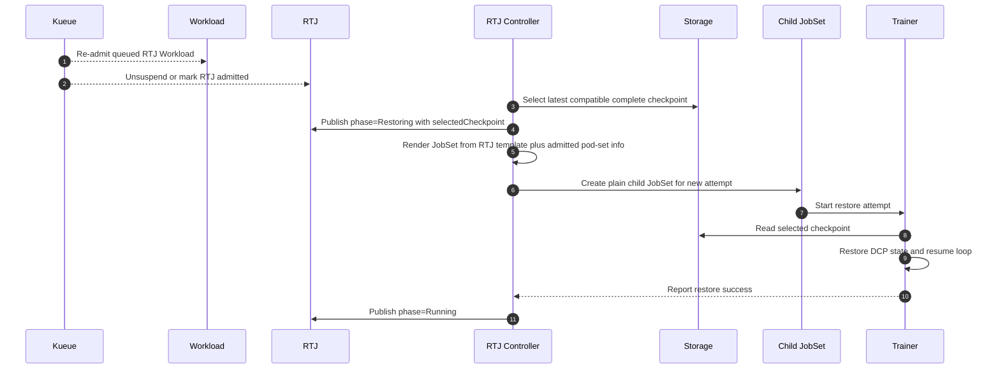

# Phase 2 Architecture

## Overview

Phase 2 moves Kueue up one layer.
In Phase 1, Kueue managed the child `JobSet`.
In Phase 2, Kueue manages the parent `RTJ` through external `jobframework` integration, while the child `JobSet` becomes a plain runtime resource created only after RTJ admission.

This gives Phase 2 the control-plane boundary we actually want:

- Kueue owns queueing, admission, and stock preemption decisions for RTJ.
- The RTJ controller owns graceful yield, checkpoint selection, and runtime launch or teardown.
- JobSet owns only runtime materialization.

## Control-Plane Boundary

| Concern | Kueue | RTJ Controller | Child JobSet |
| --- | --- | --- | --- |
| Queueing and admission | Authoritative | Observes and reacts | Not authoritative |
| Preemption decision | Authoritative | Observes and executes graceful yield | Not authoritative |
| Checkpoint selection | Not authoritative | Authoritative | Not authoritative |
| Runtime launch | Not authoritative | Authoritative | Materializes Pods |
| Runtime suspend and teardown | Not authoritative | Authoritative | Executes deletion and pod shutdown once ordered |

## Component Diagram

## Create -> Queue -> Admit -> Launch

## Kueue-Driven Preemption -> Graceful Yield -> Checkpoint -> Teardown

The post-yield steady state depends on intent source:

- if the user requested `Paused`, the steady state is `Paused`
- if Kueue suspended a still-runnable RTJ, the steady state is `Queued`

The drain path is the same in both cases.
The steady state differs because manual pause is sticky user intent, while Kueue preemption is queueing intent.

## Re-Admission -> Resume

## Key Design Notes

- The RTJ `GenericJob` implementation must derive Kueue pod sets from the embedded JobSet template without creating the child JobSet early.
- The RTJ controller must stamp admitted pod-set decisions back onto the rendered child JobSet so the runtime honors Kueue admission.
- Queue and priority identity belong on RTJ, not on the child JobSet.
- The child JobSet must not be visible to Kueue as a second workload.
- Phase 2 keeps the Phase 1 checkpoint contract, object-store contract, and run-attempt model.
- If the cluster uses Kueue features that auto-manage unlabeled workloads, Phase 2 must explicitly prevent the child JobSet from being picked up; otherwise the single-admission-object boundary breaks.
